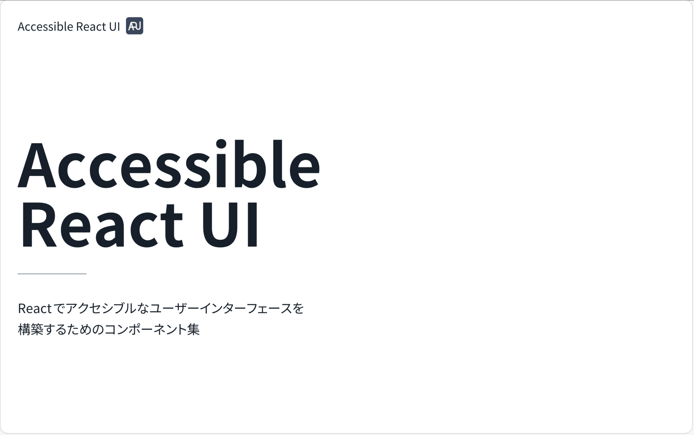

  

<h1 align="center"><a href="https://react-tokyo-fes-2026.yamanoku.net/">Accessible React UI</a></h1>

Reactでアクセシブルなユーザーインターフェースを構築するためのコンポーネント集。

## 技術スタック

- Astro
- React 18（@astrojs/reactがv18依存のため）
- Tailwind CSS

## 謝辞

このプロジェクトのコンポーネント設計・実装・アクセシビリティ修正は [Claude Sonnet 4.6](https://www.anthropic.com/claude) に協力してもらいました。

## 参考情報

- [ARIA Authoring Practices Guide | APG | WAI | W3C](https://www.w3.org/WAI/ARIA/apg/)
- [APG Patterns Examples](https://masup9.github.io/apg-patterns-examples/)
- [Exploring the challenges in creating an accessible sortable list (drag-and-drop) - The GitHub Blog](https://github.blog/engineering/user-experience/exploring-the-challenges-in-creating-an-accessible-sortable-list-drag-and-drop/)
